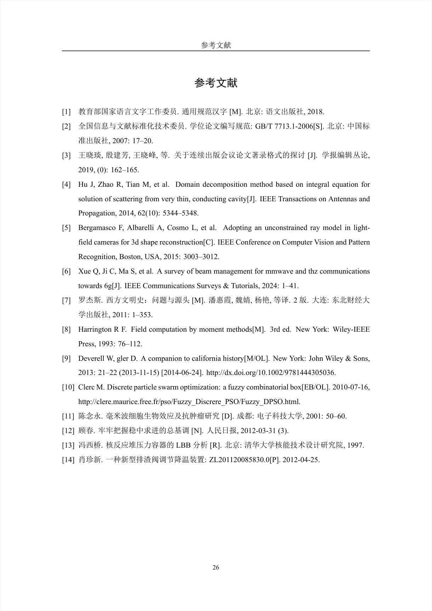

# <center> 电子科技大学学位论文模板2024 </center>

## 前言

### 适用对象

本模板基于电子科技大学[2024年研究生学位论文撰写规范](https://gr.uestc.edu.cn/xiazai/114/3917)以及通院[关于启动2021级本科毕业设计（论文）工作的通知](https://www.sice.uestc.edu.cn/info/1140/14689.htm)编写，涵盖学术学位博士、专业学位博士、学术学位硕士和专业学位硕士，**新增本科学位论文支持**。~~不适用于*本科学位论文*和*来华留学生*~~ ，仍不适用于*来华留学生*，这~~两~~类同学还请改用之前**王稳**学长编写的[thesisuestc](https://github.com/bdebye/thesisuestc "王稳成电模板")。

使用本模板的用户需要具备基本的LaTeX排版技能，后续不会对常见命令和环境的使用进行说明。

另外，本文档以及`tutorial.tex`示例源文件中明确表达了`仅学士`、`仅研究生`或`仅专业学位`意思的内容，仅供相应同学使用，其他同学应该注释或删掉与自己无关的内容。

### 使用环境

本模板在Windows平台编写，经测试在Overleaf上也能正常工作。~~由于没有设备，本模板没有任何适配MacOS的代码，不确定在该平台会出现什么情况。如有Mac用户，请上传至Overleaf使用，或者改用**王稳**学长编写的[thesisuestc](https://github.com/bdebye/thesisuestc "王稳成电模板")。~~ **经同学反馈，该模板在Mac端也能正常排版，仅会提示字体相关警告，不影响使用**。

本地用户需要有LaTeX环境，我使用的是TeXLive2024 + TeXstudio，以及TeXLive2024 + VSCode。模板需要使用`XeLaTeX`引擎编译，如各位也使用TeXstudio编辑器，则不需要对软件进行设置：`tutorial.tex`文件首行已经添加了`% !TEX Program = xelatex`，指定使用`XeLaTeX`编译该文档。对使用其他编辑器或Overleaf的用户，则需要自行将编译引擎设置为`XeLaTeX`。

经部分同学反馈，**<font color=#8b0000>此模板在TeXLive2021上会出现无法按预期渲染封面下划线的情况</font>**，所以请所有本地用户将自己的TeXLive环境更新到[TeXLive2024](https://mirror.bjtu.edu.cn/CTAN/systems/texlive/Images/)。


### 模板完成度

本模板目前已基本实现了学位论文撰写规范中的全部要求。但有~~两处~~~~一处~~两处并未实现：
1. ~~对于前置部分可能出现的主要符号表，模板仅提供了生成“主要符号表”标题的命令，并未提供生成相关内容的命令，因此需要用户自行维护主要符号表的内容，比如用`table`+`tabular`环境。之所以未做主要符号表内容的相关命令，有两点原因:~~ 已添加相对便捷地生成主要符号表内容的方式！
   - ~~查资料的过程中并未发现有相关的宏包能做到以类似缩略词表的方式生成主要符号表。~~
   - ~~对数学符号比较多的文章，通常会在每个研究内容对应的章节分别设置主要符号表；反之，用`table`+`tabular`环境在前置部分维护主要符号表的内容也不算很繁琐。~~

2. 未实现将图片中的附注排版在图题之下的功能。原因是并未查找到实现该操作的LaTeX宏包，且个人能力不足，没有实现该功能的思路。替代方法是使用脚注，即通过`\footnotemark`和`\footnotetext`相互配合，细节参见[https://blog.csdn.net/xovee/article/details/127563209](https://blog.csdn.net/xovee/article/details/127563209 "\footnotemark、\footnotetext配合使用")。或者，干脆不要在图中添加附注，改为在文中解释。

3. 伪代码环境无法跨页。本模板排版伪代码使用的包是`algorithm2e`，无法实现跨页伪码排版。注：通常来说，过长的伪码会增加读者的理解难度，更建议根据算法逻辑拆分成多个子算法或子过程，分别排版，最后汇总。

此外，不排除模板存在一些细节上的疏漏。本人尚在撰写学位论文的过程中，如发现或遇到问题仍会修复并更新。

### 开发该模板的原因

距离**王稳**学长发布[thesisuestc](https://github.com/bdebye/thesisuestc "王稳成电模板")已经过去几年了，学校的撰写规范时有调整，本模板希望及时更新相关设置，以求与最新的撰写规范保持一致。尤其是在封面页、扉页等部分，旧模板在排布结构上仍与规范一致，但部分页面元素的相对距离或大小却与规范有些出入，本模板希望将与规范间的偏差控制在毫米粒度。

另外，本模板希望进一步减少用户的工作量，为此加入了一些人性化功能。比如：

1. 本模板提供了印刷模式，该模式会根据学校的印刷规范自动在论文前置部分的必要位置插入空白页，无需用户人为处理编译后的文档，完全避免出错。PS：如果你是[thesisuestc](https://github.com/bdebye/thesisuestc "王稳成电模板")用户，切记在需要印刷时用第三方工具（如Adobe Acrobat）去插入空白页，不要尝试在`.tex`源文件中使用`\newpage`+`\thispagestyle{empty}`的组合来生成空白页，这种操作生成的空白页实际上仍然占用了一个页码编号，只是不显示了而已，会导致后续页码不连续，并不符合规范要求。而且，相信我，我翻了教研室三本打印装订的学位论文，涵盖博士和硕士，没有一个正确处理了这个问题。

2. 本模板对`algorithm`环境进行了调整。规范中本身并未说明伪代码应该如何排版，[thesisuestc](https://github.com/bdebye/thesisuestc "王稳成电模板")将伪码环境设置成了两侧边框、字体大小与正文一致、行宽与正文一致的样式，但本人更喜欢期刊模板中的伪代码样式。本模板参考规范中对表格的要求，基于`algorithm2e`宏包设计伪码样式，默认去掉了伪码两侧的框线（当然如果你喜欢，也可以在载入文档类时使用`boxruled`选项或直接在风格文件中找到`algorithm2e`宏包并编辑其选项），字体大小与表格保持一致，并去掉了伪码段首的悬挂缩进。本模板还基于调整后的`algorithm`环境封装了`algo`环境，它允许用户调整伪码浮动体到正文文本边界的总缩进距离，默认为4em（即两侧各缩进2字符），与后续段首缩进保持一致。此外，本模板还为伪码定义了`do while`和`loop`循环结构。细节参见`tutorial.tex`文档。

3. 本模板提供了便于生成形如(1-1a)的子公式编号的命令。该需求往往出现在数学模型的约束中，最常用的方式可能是使用`\tag{}`命令显示指定某条约束的编号。但是，该方式操作繁琐，而且在后续需要调整约束顺序或增删约束时很容易漏改某些tag导致子公式编号混乱，对论文作者来说这是很容易被忽略的问题。本模板提供的`\subeqtag[<子公式编号标签>]`命令完全避免了这些问题。您只需要在对应的约束后使用`\subeqtag`，该约束就会被赋予与当前主公式编号保持一致的下级编号。并且，对连续的多个约束使用该命令会**自动生成**递增的子公式编号，交换约束顺序编号也会自行更正，断不可能出错。如果您需要在正文中引用某个子公式编号，那么可以像往常一样在`\subeqtag`之后使用`\label{<编号标签>}`，或者直接指定`\subeqtag[<子公式编号标签>]`的可选参数，非常人性化。

4. 本模板优化了`.bst`文件的处理逻辑，生成参考文献列表时会自行获取文献编号最大长度，从而调整参考文献条目的悬挂缩进距离，防止产生错落的文献内容左边界。该过程完全不需要人为干预，用户原封不动地使用`\bibliographystyle{<参考文献风格文件>}`+`\bibliography{<参考文献数据库文件>}`即可。相比在[thesisuestc](https://github.com/bdebye/thesisuestc "王稳成电模板")中根据参考文献数量人为判断是否配置`\thesisbibliography[large]`的做法，本模板更加省心。

5. 本模板尽可能使用LaTeX风格编写`.cls`文件，内容更加易于理解。此外，该文件中还添加了大量详细的注释内容，包括网页链接和宏包官方文档。对有特殊需求或想要微调模板的用户更加友好。例如，你不想去掉伪码段首的悬挂缩进，则注释掉`.cls`文件中调整该距离的命令即可。


### 鸣谢

非常感谢**王稳**学长设计的[thesisuestc](https://github.com/bdebye/thesisuestc "王稳成电模板")，它一直是成电毕业生撰写学位论文的首选。也正是由于该模板，让本人产生了自行设计学位论文模板的想法并将之付诸行动。

在本模板的设计过程中，本人也借鉴了**王稳**学长的诸多设计思路，属于是站在前人的肩膀上，才能在磕磕绊绊中完成现在的雏形结果。

此外，非常感谢广大网友在各种网站（StackExchange，知乎、CSDN、博客园等）上分享的LaTeX相关知识，以我个人的能力，断不可能设计出完整可运行的LaTeX模板。甚至可以说，这个模板并非由我设计，我只是信息的收集、筛选和汇总者。

`tutorial.tex`文件中用于举例的各图片均来自于网络，如有侵权，请图片作者联系我进行删除。

## 导言区

模板的导言区只有两行：
1. `% !TEX Program = xelatex`在Texstudio中表示指定使用XeLaTeX编译该文档，对其他编辑器，可能需要用户手动设计编译引擎。

2. `\documentclass[<选项列表>]{DissertUESTC}`表示加载名为`DissertUESTC`的文档类，该文档类基于LaTeX的`book`类编写。此文档类新增~~两种~~三种选项：

   - `print`/`nonprint`：该选项控制是否以印刷模式生成文档，印刷模式会自动在论文的前置部分添加必要的空白页。默认为`print`。

   - `doctor`/`prodoctor`/`master`/`promaster`/`bachelor`：该选项设置学位论文类型，分别对应学术学位博士、专业学位博士、学术学位硕士、专业学位硕士以及学士学位。默认为`doctor`。
   
   - [**新增**]`subfigsimple`/`subfigparens`：该选项用于调整正文中对子图标签进行引用生成的编号样式，`subfigsimple`对应样式为`1-1a`，`subfigparens`对应样式为`1-1(a)`，默认为`subfigparens`。

   - 另外，`algorithm2e`宏包的`vlined`和`boxruled`选项也可以在加载文档类时设置。

## 论文封面及扉页

这部分主要通过模板提供的各种命令来完成论文封面和扉页的内容填充。在论文送审时，只需要将本小节涉及的各命令需要的参数留空即可生成对应位置为空的封面及扉页。注意，参数留空表示`{}`，而非彻底删除。

### 封面

~~生成本科生论文封面使用命令：`\bachelorcover{<论文题目>}{<学院>}{<专业>}{<学号>}{<作者姓名>}{<指导教师>}{<教师职称>}`。**（仅学士）**~~

~~生成研究生论文封面使用命令：`\uestccover{<论文题目>}{<学科专业>}{<学号>}{<作者姓名>}{<指导教师>}{<教师职称>}{<学院>}`。**（仅研究生）**~~

生成论文封面统一使用命令：`\uestccover{<论文题目>}{<学科专业>}{<学号>}{<作者姓名>}{<指导教师>}{<教师职称>}{<学院>}`。

要生成正确的论文封面必须要在文档类中指定与之对应的`doctor`/`prodoctor`/`master`/`promaster`/`bachelor`选项，然后按照上述命令各项参数的含义键入相应信息。**注意：`\uestccover`命令的参数顺序是根据研究生学位论文封面而设计，学士学位论文封面竟然与之不同。本科生务必按照命令要求的顺序填写，不要看着封面示例pdf填写。**

### 中文扉页（仅研究生）

中文扉页需要填写的内容过多，超过了LaTeX对命令最多支持9个参数的限制，因此需要先设置系列宏：

1. `\ClsNum{<分类号>}`；
2. `\ClsLv{<密级>}`；
3. `\UDC{<UDC号>}`；
4. `\DissertationTitle{<题名>}`；
5. `\Author{<作者姓名>}`；
6. `\Supervisor{<指导教师>}{<职称>}{<单位名称>}{<单位地址>}`；
7. `\AssociateSupervisor{<副导师名称>}{<职称}>{<单位名称>}{<单位地址>}`，设置副导师信息，若无则注释即可；
8. `\DegLv{<申请学位级别>}`，该信息由文档类选项自动确定，需修改默认内容时使用，否则注释即可；
9. `\Major{<学科专业>}`；
10. `\Profield{专业学位领域代码}`，此为专业学位独有，学术学位用户注释即可；
11. `\Date{<论文提交日期>}{<论文答辩日期>}`；
12. `\Grant{<学位授予单位>}{<学位授予日期>}`；
13. `\Reviewer{<答辩委员为主席>}{<评阅人>}`；

然后使用`\uestczhtitlepage`生成中文扉页。

### 英文扉页（仅研究生）

生成英文扉页使用命令：`\uestcentitlepage{<文题>}{<专业>}{<学号>}{<作者>}{<导师>}{<副导师>}{<学院>}`。若无副导师，则将`<副导师>`参数留空即可。


## 独创性声明（仅研究生）

生成独创性声明使用命令：`\declaration[<签名宽度>]{<日期>}{<作者签名图片>}{<导师签名图片>}`。`<签名宽度>`选项就是调整签名图片的显示宽度。

该命令的设计初衷是允许强迫症用户使用电子签，避免后续印刷版签字后，扫描的独创性声明歪歪扭扭，替换到电子档里影响观感。但听同学说，上传数据库的论文版本必须要是手签的，不知是否真如此严格。若的确如此，这里将全部强制参数留空即可产生原始的独创性声明页。

## 中英文摘要

中文摘要使用`\zhabstract`后继续追加内容即可，中文关键字用`\zhkeywords{<中文关键字>}`。

英文摘要使用`\enabstract`后继续追加内容即可，英文关键字用`\enkeywords{<English Keywords>}`。

## 目录、图目录、表目录、主要符号表、缩略词表

在文档中的对应位置使用对应命令即可生成各种目录和符号表：

1. 目录：`\tableofcontents`；
2. 图目录：`\listoffigures`；
3. 表目录：`\listoftables`；
4. 主要符号表：`\listofsymbs`命令+`symbtable`环境；
   * 在需要插入主要符号表的前置部分使用`\listofsymbs`命令生成主要符号表的章标题；
   * 紧接着使用`symbtable`环境排版主要符号表的内容，该环境基于`longtable`环境进行封装，依次接受两个可选参数：`\begin{symbtable}[<表格整体位置>](<主要符号表的列控制参数>)`。
     - 第一项可选参数用于设置`longtable`环境的可选参数，且默认值与`longtable`环境保持一致；
     - 第二项可选参数用于设置`longtable`环境的必选参数，其默认值设置为`p{3.5em} p{\linewidth-9em} p{3em}<{\centering}`。

    若非必要，用户不应指定`symbtable`环境的可选参数。但若出于对排版美观性的考虑，可适当调整主要符号表各列的宽度。注意，按照学位论文撰写规范中的示例，**主要符号表有且仅有三列**。因此，切勿对第二项可选参数设置其他列数。

    **重要提醒：**`listofsymbs`命令和`symbtable`环境必须同时出现或消失。消失好理解，不需要主要符号表的时候，通通注释掉即可；需要的时候，必须使用`symbtable`环境生成表格内容，因为在印刷模式下，这部分结束时是否需要添加左手空白页的判断逻辑放在了`symbtable`环境结束时（自动）执行。
5. 缩略词表相对复杂一些：
   * 先使用`\printnomenclature[<英文缩写宽度>](<中文全称宽度>)`，第一项可选参数控制**英文缩写**的列宽，默认为`5em`；第二项可选参数控制**中文全称**的列宽，默认为`7.5em`。
   * 然后在正文中出现缩略词的位置使用命令`\nomchn{<缩略词>}{<英文全称>}{<中文全称>}`添加该缩略词条目。

另外，本地用户需要先编译生成缩略词表的辅助文件，再编译完整文档才能获得正确的结果，教程参见[编译缩略词表](https://zhuanlan.zhihu.com/p/46442713 "本地缩略词表编译教程")。Overleaf用户则可以一键搞定，无需额外操作。


## 论文主体部分

### 各级标题

本模板基于`book`类，所以章标题需要使用`\chapter{<章标题>}`生成，其他各级标题依次为`\section{<节标题>}`、`\subsection{<子节标题>}`、`\subsubsection{<孙节标题>}`。

### 图片

本模板使用`graphicx`和`subfig`宏包来处理插入的图片及子图。细节请参考`tutorial.tex`中的源码。

需要将待排版图片文件放入项目目录`./fig/`中。

### 表格

#### 普通表格

普通表格的排版本身无需多言，使用`table`+`tabular`环境即可，但是要注意三线表中的三条线分别需要使用`\toprule`、`\midrule`、`\bottomrule`生成，这样才符合研究生规范中对线高的要求（`1.5`磅、`0.75`磅、`1.5`磅）。注意不要用`\hline`。而对于本科生，学士学位论文规范要求表格中的线高统一为`0.5`磅，在`bachelor`选项下，`\midrule`的线高设置为`0.5`磅。因此，本科生在表格中只需要也只可以使用`\midrule`和`\cmidrule`，否则线高将不符合要求。

在需要为表格中的某些单元格添加水平框线时，应使用`\cmidrule[<线高>](<修剪>){<起始列-终止列>}`而非`\cline{<起始列-终止列>}`。后者似乎无法调整线高，也无法对框线的端点进行修剪。前者的第一项可选参数允许用户设置框线高度，其默认值在`bachelor`选项下设置为了`0.5`磅，而在其他论文类型下设置为了`0.75`磅。如非必要，用户无需设置该可选参数；第二项可选参数允许用户对框线的端点进行修剪，当需要避免同行独立的相邻框线在视觉上连通到一起时，该选项将很有用。有关第二项可选参数可取的值，建议用户查阅`booktabs`宏包的官方文档。

#### 带附注表格

更需要说明的是生成带附注的表格。本模板采用`threeparttable`宏包实现将表格中的附注内容顶格排版在表格底部：

1. 使用`\tnote{<label>}`在表格中插入上标编号；
2. 使用`tablenotes`环境在表格底部排版附注。该环境提供选项`online`用于将附注文本前的标号从默认的上标样式更改为同行样式。

#### 跨页表格

原则上，长度不足一页的表格不应跨页。而对于本身超过一页的表格，本模板使用`longtable`宏包提供的`longtable`环境实现。用户需要了解`longtable`环境的基本使用方法，它与`tabular`环境的最大区别在于需要用户自行定义分页后的表题、表头以及表尾。

本模板提供了命令`\CPcaption{<跨页表题>}`来正确排版跨页之后的表题，务必使用此命令，否则跨页后的表题将会与表格内容采用相同的行距和段前段后，而非与规范中要求的表题格式保持一致。

此外，不应将`longtable`环境嵌套在`table`等浮动环境中，否则长表格将无法正常跨页。

更多细节参考`tutorial.tex`中的相应源码。

### 伪代码

伪代码基于`algorithm2e`宏包提供的`algorithm`环境，默认不添加左右侧框线，且顶部框线和底部框线类比规范对表格的要求进行了加粗，字体大小也调整到了**五号字**，与表格保持一致。用户可以在载入文档类时添加`boxruled`选项来恢复左右侧框线。该环境生成的伪码与正文文本保持相同宽度。

除了`algorithm2e`宏包本身提供的各种条件、循环语句，本模板基于宏包提供的接口，追加了`Do While`和`Loop`循环语句：
- `\DoWhile(<紧跟关键字do的文本，可用于添加注释>){<循环条件>}{<循环体>}`
- `\Loop(<紧跟关键字loop的文本，可用于添加注释>){<循环体>}`

此外，基于调整后的`algorithm`环境，本模板进一步封装了`algo`环境。从名字上可以看出，`algo`环境比`algorithm`环境生成的伪码浮动区域更**窄**。它除了接受浮动可选参数`[htbp]`，还提供了另一可选参数`(<伪码距正文文本边界的总距离>)`，该参数控制的是浮动体离正文文本边界的总距离，默认是`4em`，即单边缩进`2em`，与下方首行文本对齐。两种可选参数可以单独使用或同时使用，但要注意同时使用时的顺序必须与下方例子保持一致。

```tex
\begin{algo}[<浮动选项>](<伪码距正文文本边界的总距离>)
    .....
\end{algo}
```

### 定义、定理、命题、推论、引理、证明

本模板为上述内容分别定义了环境：`definition`、`theorem`、`proposition`、`corollary`、`lemma`和`proof`。

### 脚注

本模板使用包含了带圈数字的字体来替换LaTeX绘制的带圈数字，提供了充足的带圈编号数量，同时保证了带圈脚注编号足够优雅。

在正文中加入脚注直接在需要放置脚注标签的位置使用`\footnote{<脚注内容>}`即可。

在其他环境中，如表格，则需要需要使用`\footnotemark`+`\footnotetext{<脚注文本>}`。在需要放置脚注标签的位置使用`\footnotemark`，然后在环境外使用`\footnotetext{<脚注文本>}`指明脚注内容。更详细的使用方法参考[LaTeX脚注](https://blog.csdn.net/xovee/article/details/127563209 "\footnotemark+\footnotetext配合生成脚注")。

### 模板中的各种编号

标题、图片、表格、伪码、公式、定义、定理、命题、推论、引理、证明、脚注这些文档元素的编号都是自行计算并生成的，无需劳烦用户。**但形如(1-1a)的子公式编号不能完全自动生成**，为此，模板提供了较为便捷的`\subeqtag[<子公式编号标签>]`命令让用户花尽可能少的精力做到这一点，且保证完全不会出错。

该需求往往出现在数学模型的约束中，最常用的方式可能是使用`\tag{}`命令显示指定某条约束的编号。但是，该方式操作繁琐，而且在后续需要调整约束顺序或增删约束时很容易漏改某些tag导致子公式编号混乱，对论文作者来说这是很容易被忽略的问题。

本模板提供的`\subeqtag[<子公式编号标签>]`命令完全避免了上述问题。您只需要在对应的约束后使用`\subeqtag`，该约束就会被赋予与当前主公式编号保持一致的下级编号。并且，对连续的多个约束使用该命令会**自动生成**递增的子公式编号，交换约束顺序编号也会自行更正，断不可能出错。

如果您需要在正文中引用某个子公式编号，那么可以像往常一样在`\subeqtag`之后使用`\label{<编号标签>}`，或者直接指定`\subeqtag[<子公式编号标签>]`的可选参数，一条命令就搞定，非常人性化。详情可以参考`tutorial.tex`中给出的示例。

有两点需要提醒:
1. `\subeqtag[<子公式编号标签>]`的可选参数全文不可重复定义，因为它本质上还是调用的`\label{<编号标签>}`，不用多说。

2. 尽管为`\subeqtag[<子公式编号标签>]`指定可选参数是基于`\label{<编号标签>}`进行的封装，在TexStudio这样的编辑器上使用`\ref{<编号标签>}`或`\eqref{<编号标签>}`却不会自动弹出这些标签的选项，需要用户手动输入；而如果是直接用`\label{<编号标签>}`指定的标签，引用时会出现在提醒选项中，用户可以直接选择，这算是`\subeqtag[<子公式编号标签>]`不太方便的点，可惜我并不知道该如何解决。

### 引用

对公式、图片、表格、伪码、定义、定理、命题、推论、引理、证明等编号的引用直接用`\ref{<编号label>}`即可，其中需要带括号公式编号则使用`\eqref{<公式label>}`。

若要对子图题编号进行完整引用直接使用`\ref{<子图题标签>}`即可，`DissertUESTC`文档类默认生成形如`1-1(a)`的完整编号，但若用户指定了文档类的`subfigsimple`选项，则会生成形如`1-1a`的完整编号（*注：学位论文撰写规范中并未明确说明引用子图编号应该采用哪种形式，但我翻了本中文专著，里面采用的`1-1(a)`形式，故而设为了默认样式*）；反之，若只希望单独引用子图题编号，比如在图题结尾按编号添加子图题文本，则需要使用`\subref{<子图题标签>}`，它将生成形如`(a)`的单独编号。

对参考文献的行内引用直接使用`\cite{<参考文献label>}`，以上标形式引用则使用`\citess{<参考文献label>}`。

引用参考文献是基于`natbib`宏包实现，单次引用多篇参考文献时会自动排序并压缩序号（如果可以的话）。

另外，研究生论文规范要求正文中引用的公式编号样式采用英文括号，即`(1-1)`，而本科论文规范中则要求是中文括号，即`（1-1）`。在公式右侧的编号中，两者均采用英文括号。此间区别完全由相应的选项（`doctor`/`prodoctor`/`master`/`promaster`/`bachelor`）控制，用户无需过问，但一定要确保自己写对了选项。

## 致谢

生成**致谢章**使用`\acknowledgement`，而后编辑内容即可。该命令本质上是对`\chapter*{}`的封装，加入了生成目录项、书签条目以及修改页眉的命令。

## 参考文献

本模板实现了规范中列举的**期刊论文**、**会议论文**、**专著**、**学位论文**、**报纸文章**、**报告**、**授权专利**、**标准**、**电子文献**，共计9种文献类型的排版风格。

本模板为这些文献类型定义的`.bib`数据库条目**类型标识**分别为`article`、`inproceedings/conference`、`book`、`mastersthesis/phdthesis`、`news`、`report`、`patent`、`standard`、`digital`。

不同文档类型条目包含不同的域，下面列举了一些[研究生学位论文撰写规范](https://gr.uestc.edu.cn/xiazai/114/3917)中用作示例的参考文献对应的`.bib`数据库形式，完全覆盖上述9种文献类型：

```bib
@book{教育部国家语言文字工作委员2018,
    author={教育部国家语言文字工作委员},
    title={通用规范汉字},
    address={北京},
    publisher={语文出版社},
    year={2018},
    language={schinese},
}
```

```bib
@standard{学位论文编写规范555,
    author={全国信息与文献标准化技术委员},
    title={学位论文编写规范},
    number={GB/T 7713.1-2006},
    address={北京},
    publisher={中国标准出版社},
    year={2007},
    pages={17--20},
}
```

```bib
@article{王晓琰2019关于连续出版会议论文著录格式的探讨,
    title={关于连续出版会议论文著录格式的探讨},
    author={王晓琰 and 殷建芳 and 王晓峰 and 邓迎 and 杨蕾},
    journal={学报编辑丛论},
    number={0},
    year={2019},
    pages={162--165},
    language={schinese},
}
```

```bib
@article{hu2014domain,
    title={Domain decomposition method based on integral equation for solution of scattering from very thin, conducting cavity},
    author={Hu, Jun and Zhao, Ran and Tian, Mi and Zhao, Huapeng and Jiang, Ming and Wei, Xiang and Nie, Zai Ping},
    journal={IEEE Transactions on Antennas and Propagation},
    volume={62},
    number={10},
    pages={5344--5348},
    year={2014},
    publisher={IEEE}
}
```

```bib
@inproceedings{bergamasco2015adopting,
    title={Adopting an unconstrained ray model in light-field cameras for 3d shape reconstruction},
    author={Bergamasco, Filippo and Albarelli, Andrea and Cosmo, Luca and Torsello, Andrea and Rodola, Emanuele and Cremers, Daniel},
    booktitle={IEEE Conference on Computer Vision and Pattern Recognition},
    pages={3003--3012},
    year={2015},
    organization={Boston, USA}
}
```

```bib
@article{xue2024survey,
    title={A survey of beam management for mmWave and THz communications towards 6G},
    author={Xue, Qing and Ji, Chengwang and Ma, Shaodan and Guo, Jiajia and Xu, Yongjun and Chen, Qianbin and Zhang, Wei},
    journal={IEEE Communications Surveys \& Tutorials},
    year={2024},
    pages={1--41},
    publisher={IEEE}
}
```

```bib
@book{罗杰斯2011,
    author={罗杰斯},
    title={西方文明史：问题与源头},
    translator={潘惠霞 and 魏婧 and 杨艳 and 汤玲},
    edition={2},
    address={大连},
    publisher={东北财经大学出版社},
    year={2011},
    pages={1-353},
    language={schinese},
}
```

```bib
@book{harrington1993field,
    title={Field computation by moment methods},
    author={Harrington, Roger F},
    year={1993},
    pages={76--112},
    edition={3},
    address={New York},
    publisher={Wiley-IEEE Press}
}
```

```bib
@digital{电子文献1,
    author={Deverell, W and gler, D},
    title={A companion to California history},
    type={M/OL},
    modifydate={2013-11-15},
    url={http://onlinelibrary.wiley.com/doi/.ch2/summary},
    doi={10.1002/9781444305036},
    address={New York},
    publisher={John Wiley \& Sons},
    year={2013},
    pages={21-22},
    citedate={2014-06-24},
}
```

```bib
@digital{电子文献2,
    author={Clerc, M},
    title={Discrete particle swarm optimization: a fuzzy combinatorial box},
    type={EB/OL},
    modifydate={2010-07-16},
    url={http://clere.maurice.free.fr/pso/Fuzzy_Discrere_PSO/Fuzzy_DPSO.html},
}
```

```bib
@mastersthesis{陈念永2001毫米波细胞生物效应及抗肿瘤研究,
    author={陈念永},
    title={毫米波细胞生物效应及抗肿瘤研究},
    address={成都},
    school={电子科技大学},
    year={2001},
    pages={50--60},
}
```

```bib
@news{顾春20122,
    author={顾春},
    title={牢牢把握稳中求进的总基调},
    publisher={人民日报},
    year={2012},
    month={03},
    day={31},
    number={3},
}
```

```bib
@report{冯西桥1997,
    author={冯西桥},
    title={核反应堆压力容器的{LBB}分析},
    address={北京},
    publisher={清华大学核能技术设计研究院},
    year={1997},
}
```

```bib
@patent{肖珍新2012,
    author={肖珍新},
    title={一种新型排渣阀调节降温装置},
    number={ZL201120085830.0},
    year={2012},
    month={04},
    day={25},
}
```

这些`.bib`数据依次编译后的结果见下图，用户可对应查看。感兴趣的朋友可与[研究生学位论文撰写规范](https://gr.uestc.edu.cn/xiazai/114/3917)中给出的结果进行对比，看看是否做到了完全复刻。



生成参考文献最耗费精力的是维护正确的`ref.bib`数据库。在这之后，只需要在正文的对应位置使用以下两行代码即可插入完整的参考文献列表：
```tex
\bibliographystyle{DissertUESTC}
\bibliography{ref}
```

多说两句：

1. 对于某些缺少非必要信息的文献，本模板提供的`.bst`文件依然可以正确处理。比如上图中[3]这篇期刊论文缺少卷号，它仍能仅排版期号，这是符合规范的。再比如，文献[10]比文献[9]少了**出版地**、**出版者**等信息，依然能正常排版；但是注意，[10]已经是这类文献的最简形式，不可再缺信息。

2. 对中文参考文献，如果希望将它们的第四顺位及以后的作者显示为`“等”`，则必须要在它们的bib条目中加入`language={}`域，并将值设置为`schinese`。这是文献编译引擎判断该条参考文献是否是中文的唯一依据。类似的，上图[7]中的`“等译”`、`“2版”`均靠设置`language={schinese}`实现。我的建议是，虽然`language`域并非是强制添加的，但对于中文文献，最好将其添加进去。

3. 对电子文献，其类型众多，因此需要用户通过`type={}`域显式指定，如上图中的[9]和[10]；而对其他的文献类型，只要在`@`符号后输入了正确的类型标识，对应的类型标签会自动生成，无需用户手动逐条添加。

## 附录

添加附录需要先在**附录开始的位置**使用`\appendix`，而后照常使用`\chapter{}`、`\section{}`等标题命令产生各级附录标题。

## 攻读学位期间取得的成果（仅研究生）

生成**成果章**使用`\achievement`，而后编辑内容即可。其实现原理与`\acknowledgement`一致。